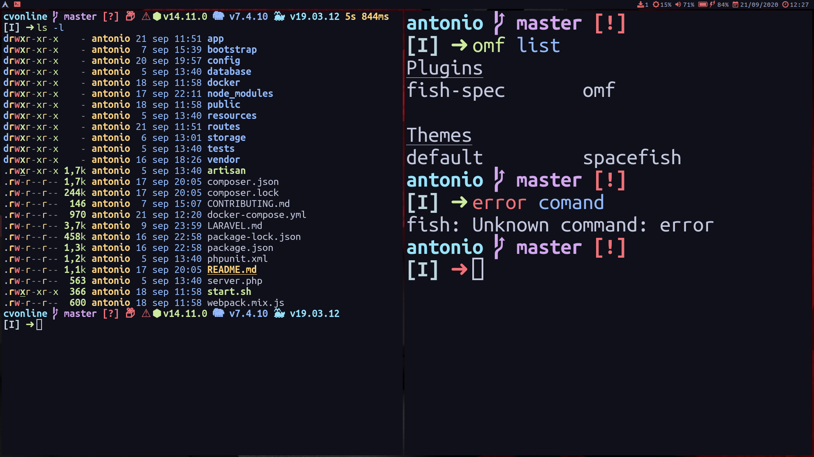

# Fish



***Language***
- [🇪🇸 Español](./README.es.md)
- 🇺🇸 English

Install *fish* and dependencies:

```bash
sudo pacman -S fish
curl -L https://get.oh-my.fish | fish
```

Copy my configs:

```bash
git clone https://github.com/antoniosarosi/dotfiles.git
cp -r dotfiles/.config/fish ~/.config
cp -r dotfiles/.config/omf ~/.config
```
Install *omf* packages:

```bash
omf install
```

Change your shell:

```bash
# List available shells
chsh -l
# Change shell
chsh -s /bin/fish
```

Themes:

```bash
omf theme agnoster
omf theme spacefish
```
