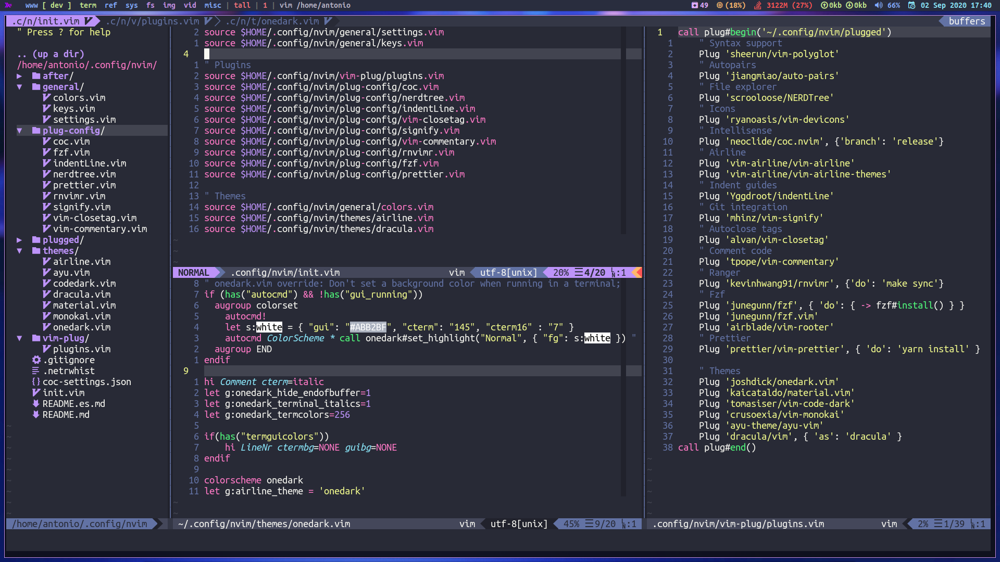

***Idioma***
- 🇪🇸 Español
- [🇺🇸 English](https://github.com/antoniosarosi/dotfiles/tree/master/.config/nvim)


Para usar esta configuración, primero descarga las dependencias:

```bash
# Vim-plug
sh -c 'curl -fLo "${XDG_DATA_HOME:-$HOME/.local/share}"/nvim/site/autoload/plug.vim --create-dirs \
       https://raw.githubusercontent.com/junegunn/vim-plug/master/plug.vim'

# Instala solo los que no tienes
sudo pacman -S nodejs npm python python-pip ruby rubygems

# Paquetes de neovim
pip install neovim
gem install neovim
sudo npm i -g neovim

# Otras dependencias
sudo pacman -S xsel fzf ripgrep fd the_silver_searcher prettier
yay -S universal-ctags-git
```

Después ejecuta ```:PlugInstall``` dentro de neovim y debería funcionar.

## Vscode

Copia los archivos ```settings.json``` y ```keybindings.json``` de mi
[gist](https://gist.github.com/antoniosarosi/eb8d73a580eaa3e7dc32b0b803b4654d).
y después instala las extensiones
[Neovim](https://marketplace.visualstudio.com/items?itemName=asvetliakov.vscode-neovim)
y
[Which Key](https://marketplace.visualstudio.com/items?itemName=VSpaceCode.whichkey).

Estos son algunos atajos de teclado que tengo aparte de los que vienen por
defecto:

| Atajo                  | Acción                                  |
| ---------------------- | --------------------------------------- |
| **jk** o **kj**        | Cambiar a modo normal (desde insertar)  |
| **alt + [hjkl]**       | Cambiar split de tamaño                 |
| **control + [hjkl]**   | Navegar splits                          |
| **control + s**        | Guardar                                 |
| **control + q**        | Guardar y salir                         |
| **tab**                | Siguiente buffer                        |
| **shift + tab**        | Buffer previo                           |
| **control + b**        | Cerrar buffer                           |
| **shift + <** or **>** | Identar o borrar indentación (visual)   |
| **shift + k** o **j**  | Mover línea seleccionada abajo o arriba |

***Plugins***:

| Atajo         | Acción                                  |
| ------------- | --------------------------------------- |
| **space + f** | Búsqueda                                |
| **space + /** | Comentar la línea o bloque seleccionado |
| **space + n** | NerdTree                                |
| **space + p** | Formatear documento con prettier        |
| **shift + k** | Documentación de la función o clase     |
