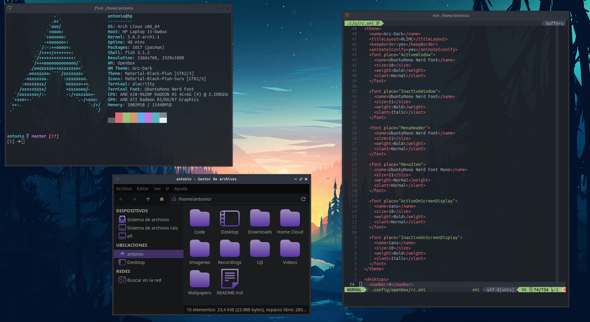

# Openbox



***Language***
- [🇪🇸 Español](./README.es.md)
- 🇺🇸 English

Install *openbox* and dependencies:

```
sudo pacman -S openbox tint2
yay -S nerd-fonts-ubuntu-mono
```

Clone this repository and copy my configs:

```bash
git clone https://github.com/antoniosarosi/dotfiles.git
cp -r dotfiles/.config/openbox ~/.config
cp -r dotfiles/.config/tint2 ~/.config
```

Once that's done, you can login. But keep in mind keybindings will not work
unless you have the same programs that I use and the same configs. You can
either change keybindings or install the software I use and my config files,
check out [this section](https://github.com/antoniosarosi/dotfiles#keybindings)
for instructions.
