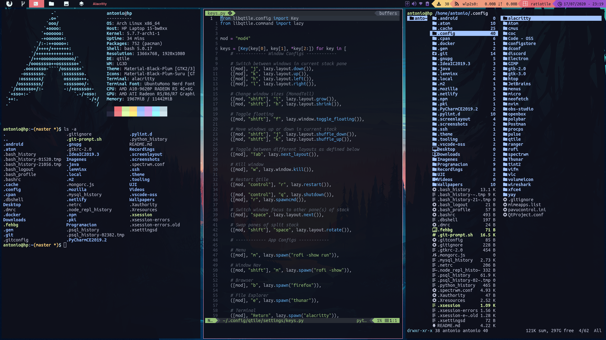

# Qtile Config

If you want to try this config make sure to download this entire directory
and locate it in *~/.config/qtile*. Keybindings might not work if you don't
have all the software listed [here](https://github.com/antoniosarosi/dotfiles#Software).
You can simply edit the keybindings to match your programs.

Also, check [this directory](https://github.com/antoniosarosi/dotfiles/tree/master/.theme)
if you want to change the theme of all your programs on startup or on window
manager restart.

