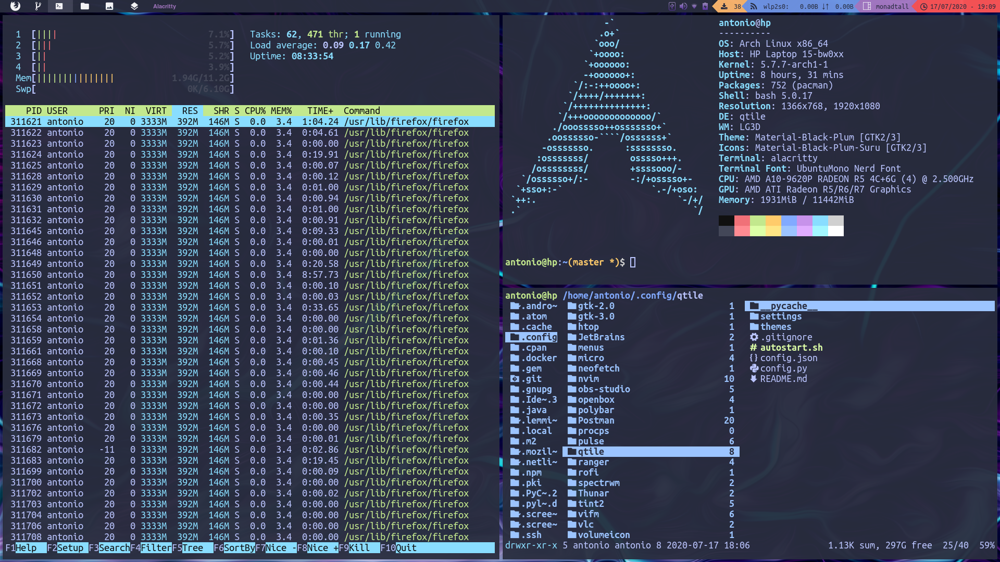

# Qtile



***Language***
- [🇪🇸 Español](./README.es.md)
- 🇺🇸 English

## Installation (Arch based)

Install Qtile and dependencies:

```
sudo pacman -S qtile pacman-contrib
yay -S nerd-fonts-ubuntu-mono
pip install psutil
```

Clone this repository and copy my configs:

```bash
git clone https://github.com/antoniosarosi/dotfiles.git
cp -r dotfiles/.config/qtile ~/.config
```

Test it with **[Xephyr](https://wiki.archlinux.org/index.php/Xephyr)**:

```bash
Xephyr -br -ac -noreset -screen 1280x720 :1 &
DISPLAY=:1 qtile
```

If the network widget doesn't work check ```./settings/widgets.py``` and look
for this line, you should find it inside a list called *primary_widgets*:

```python
# Change interface arg, use ip address to find which one you need
 widget.Net(**base(bg='color3'), interface='wlp2s0'),
```

Once that's done, you can login. But keep in mind keybindings will not work
unless you have the same programs that I use and the same configs. You can
either change keybindings or install the software I use and my config files,
check out [this section](https://github.com/antoniosarosi/dotfiles#keybindings)
for instructions.

## Structure

In ```config.py```, which is the file where most people write all their config,
I only have an *autostart* function and some other variables like
*cursor_warp*.

```python
@hook.subscribe.startup_once
def autostart():
    subprocess.call([path.join(qtile_path, 'autostart.sh')])
```

If you want to change *autostart* programs, open  ```./autostart.sh```.

```bash
#!/bin/sh

# systray battery icon
cbatticon -u 5 &
# systray volume
volumeicon &
```

If you want to modify keybindings, open ```./settings/keys.py```. To modify
workspaces, use ```./settings/groups.py```. Finally, if you want to add more
layouts, check ```./settings/layouts.py```, the rest of files don't need any
configuration.

## Themes

To set a theme, check which ones are available in ```./themes```, and write
the name of the theme you want in a file named ```./config.json```:

```json
{
    "theme": "material-ocean"
}
