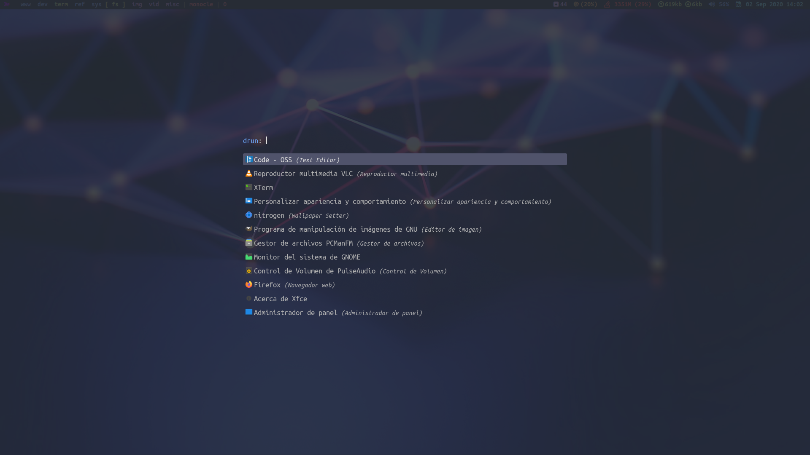

# Rofi



***Language***
- [🇪🇸 Español](./README.es.md)
- 🇺🇸 English

Install *rofi* and dependencies:

```bash
sudo pacman -S rofi papirus-icon-theme
yay -S nerd-fonts-ubuntu-mono
git clone https://github.com/davatorium/rofi-themes.git
sudo cp rofi-themes/User\ Themes/onedark.rasi /usr/share/rofi/themes
```

Delete this line in **/usr/share/rofi/themes/onedark.rasi**

```css
font: "Knack Nerd Font 14";
```

Copy my configs:

```bash
git clone https://github.com/antoniosarosi/dotfiles.git
cp -r dotfiles/.config/rofi ~/.config
```

If you are using my window manager configs, **mod + m** will launch
*rofi -show drun* (menu) and **mod + shift + m** will launch *rofi -show* (window navigation).
