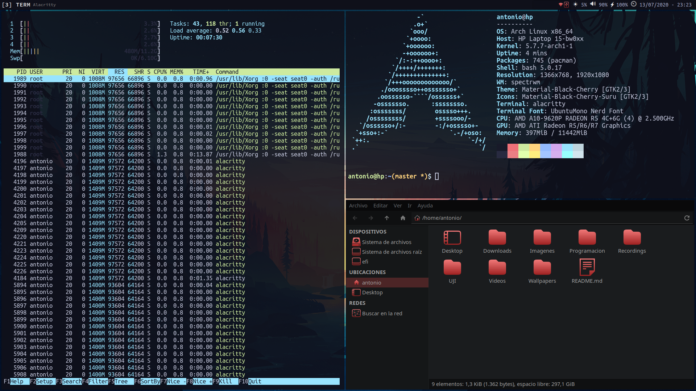

# Spectrwm



***Idioma***
- [🇪🇸 Español](./README.es.md)
- 🇺🇸 English

## Installation

Install Spectrwm and dependencies:

```bash
sudo pacman -S spectrwm trayer upower pamixer brightnessctl pacman-contrib
yay -S nerd-fonts-ubuntu-mono
```

Clone this repository and copy my configs:

```bash
git clone https://github.com/antoniosarosi/dotfiles.git
cp -r dotfiles/.config/spectrwm ~/.config
```

## Autostart

This config, unlike [Qtile's](https://github.com/antoniosarosi/dotfiles/tree/master/.config/qtile),
is pretty simple, Spectrwm doesn't allow much hacking as it is configured with
a `.conf` file. First, we have an `autostart` script, which launches `trayer`:

```bash
#!/bin/bash

# Spectrwm autostart script

trayer                 \
    --edge top         \
    --monitor 1        \
    --widthtype pixel  \
    --width 100        \
    --heighttype pixel \
    --height 18        \
    --align right      \
    --margin 455       \ # Adjust this value if necessary
    --transparent true \
    --alpha 0          \
    --tint 0x0F101A    \
    --iconspacing 3    \
    --distance 1 &
```

## Baraction

Then we have a *baraction* script, in order for it to work properly you need
these dependencies:

```bash
sudo pacman -S pacman-contrib upower brightnessctl pamixer
```

Test it with [`Xephyr`](https://wiki.archlinux.org/index.php/Xephyr):

```bash
Xephyr -br -ac -noreset -screen 1280x720 :1 &
DISPLAY=:1 spectrwm
```

If the battery doesn't work (if you're on a laptop, obviously), look for this
line in `baraction.sh`:

```bash
bat=`upower -i /org/freedesktop/UPower/devices/battery_BAT1 |
    grep percentage |
    sed 's/ *percentage: *//g'`
```

You might need to change `battery_BAT1` to the value you see in this output:

```bash
upower -d
```

Once that's done, you can login. But keep in mind keybindings will not work
unless you have the same programs that I use and the same configs. You can
either change keybindings or install the software I use and my config files,
check out [this section](https://github.com/antoniosarosi/dotfiles#keybindings)
for instructions.

## Bar format

In `spectrwm.conf` you can find this line:

```ini
bar_format = +|L+@fn=2; +@fn=0;+@fg=1; +D+@fn=1;+@fg=2;+3<+W+|R+@fn=2;+A
```

It has a weird syntax, but basically each time you see `+@fn=X;` it uses a
different font, and `+@fg=X;` means a different foreground. This is how fonts
and colors are defined:

```ini
# ...
bar_font = UbuntuMono Nerd Font:size=16, UbuntuMono Nerd Font:size=10, UbuntuMono Nerd Font:size=13
# ...
bar_font_color[1] = rgb:a6/ac/cd, rgb:e4/6a/6a, rgb:4c/56/6a
# ...
```

Read the man page for specific documentation:

```bash
man spectrwm
```

Read `spectrwm.conf` and `~/.config/spectrwm/baraction.sh` to understand
the rest of the config.
