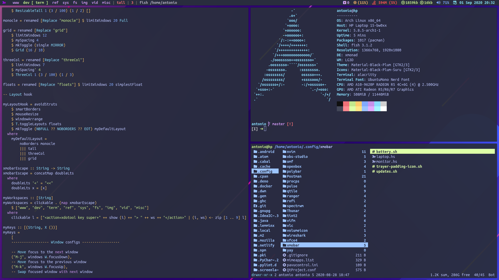

# Xmonad



***Idioma***
- 🇪🇸 Español
- [🇺🇸 English](https://github.com/antoniosarosi/dotfiles/tree/master/.xmonad)

## Instalación

Esta es la forma de usar mis configuraciones de *Xmonad*:

```bash
# Primero, instala las dependencias
sudo pacman -S xmonad xmonad-contrib xmobar trayer xdotool
yay -S nerd-fonts-ubuntu-mono

# Clona este repositorio y copia mis configuraciones
git clone https://github.com/antoniosarosi/dotfiles.git
cp -r dotfiles/.config/xmonad ~/.config
cp -r dotfiles/.config/xmobar ~/.config
```

*Xmobar* no funcionará si no tienes mis scripts de
**[~/.local/bin](https://github.com/antoniosarosi/dotfiles/tree/master/.local/bin)**.

```bash
cp dotfiles/.local/bin/percentage ~/.local/bin/
cp dotfiles/.local/bin/battery ~/.local/bin/
cp dotfiles/.local/bin/brightness ~/.local/bin/
cp dotfiles/.local/bin/volume ~/.local/bin/

# Dependencias de estos scripts
sudo pacman -S pacman-contrib brightnessctl pamixer upower
```

Pon esto en tu **~/.xprofile**:

```bash
export PATH=$HOME/.local/bin:$PATH
```

Compila *Xmonad* y deberías poder iniciar sesión o testearlo con
**[Xephyr](https://wiki.archlinux.org/index.php/Xephyr)**:

```bash
xmonad --recompile
Xephyr -br -ac -noreset -screen 1280x720 :1 &
DISPLAY=:1 xmonad
```

## Xmobar

Si ves que lanza *Xmobar*, sabes que la configuración es correcta. Modifica
las instancias de *Xmobar* según la cantidad de monitores que tienes. Así es
como los tengo yo:

```haskell
main = do
    -- Xmobar
    xmobarLaptop <- spawnPipe "xmobar -x 0 ~/.config/xmobar/primary.hs"
    xmobarMonitor <- spawnPipe "xmobar -x 1 ~/.config/xmobar/secondary.hs"
```

Por ejemplo, si solo quieres una barra, borra la línea de *xmobarMonitor*. Si
quieres 3, copia y pega esa línea y cambiale el nombre a la tercera barra.
También tienes que modificar la línea siguiente para eliminar una instancia de
*Xmobar* o añadir una nueva.

```haskell
ppOutput = \x -> hPutStrLn xmobarLaptop x >> hPutStrLn xmobarMonitor x,
```

Solo una barra:

```haskell
ppOutput = \x -> hPutStrLn xmobarLaptop x
```

Tres barras:

```haskell
ppOutput = \x -> hPutStrLn xmobarLaptop x >> hPutStrLn xmobarMonitor1 x >> hPutStrLn xmobarMonitor2 x,
```

Si la batería no funciona (si estás en un portátil, claro),  busca esta línea en
**~/.local/bin/battery**:

```bash
bat=`upower -i /org/freedesktop/UPower/devices/battery_BAT1 |
    grep percentage |
    sed 's/ *percentage: *//g'`
```

Puede que necesites cambiar *battery_BAT1* por el valor que veas en esta salida:

```bash
upower -d
```

Una vez eso está hecho, puedes iniciar sesión. Pero recuerda que los atajos de
teclado no funcionarán a no ser que tengas todos los programas que uso yo y las
mismas configuraciones. Puedes cambiar los atajos de teclado o bien instalar el
software que uso yo, mira
[esta sección](https://github.com/antoniosarosi/dotfiles/blob/master/README.es.md#atajos-de-teclado)
para las instrucciones.

## Autostart

Puedes encontrar estas líneas en **./xmonad.hs**:

```haskell
myStartupHook :: X ()
myStartupHook = do
    spawnOnce "trayer --edge top  --monitor 1 --widthtype pixel --width 40 --heighttype pixel --height 18 --align right --transparent true --alpha 0 --tint 0x292d3e --iconspacing 3 --distance 1 &"
    setWMName "LG3D"
```

No tengo un script aparte para lanzar programas, solo uso *trayer*, pero si
necesitas uno, puedes hacer algo como esto:

```bash
touch ~/.xmonad/autostart.sh
echo "#!/bin/bash" > ~/.xmonad/autostart.sh
chmod u+x ~/.xmonad/autostart.sh
```

Ahora escribe lo que necesitas en el script, y cambia las líneas anteriores por:

```haskell
myStartupHook :: X ()
myStartupHook = do
    spawnOnce "/home/username/.xmonad/autostart.sh &"
    setWMName "LG3D"
```
