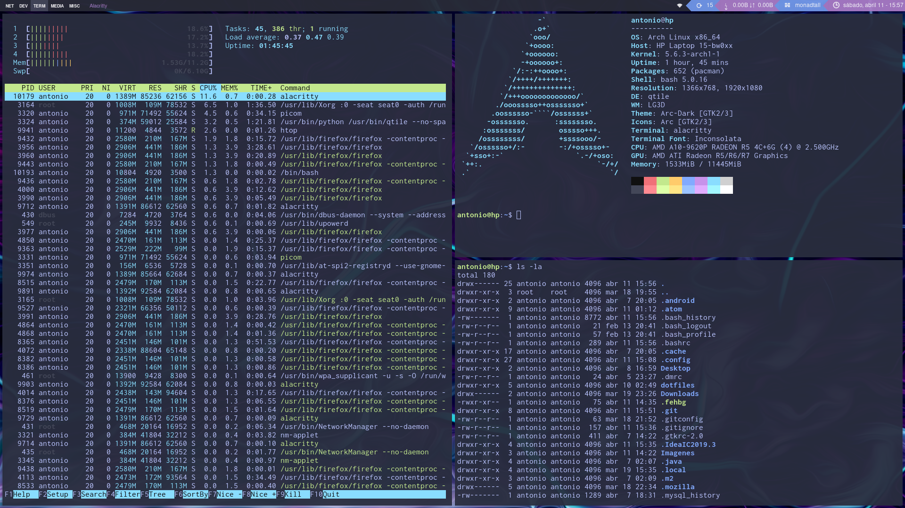

# Dotfiles & Configs

https://www.youtube.com/watch?v=VoJOOx2WLy0&t=255s



# Tutorial
```bash
git clone https://github.com/antoniosarosi/dotfiles
cd dotfiles
cp -R /home/usuario/dotfiles /home/usuario
```

# Paquetes usados
<ul>
<li>Picom (transparencias)</li>
<li>Feh (fondo)</li>
<li>Alacritty (terminal)</li>
<li>Firefox (explorador)</li>
<li>Thunder (gestor archivos)</li>
<li>Rofi (gestor archivos #2)</li>
</ul>
